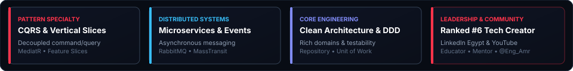
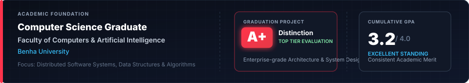

  

 

  

 

---

### 🚀 About Me

Hi, I'm **Amr Mohamed Shawky** — a **Computer Science Graduate from Benha University**, **Full Stack .NET Engineer**, **Software Architect**, and **Technical Content Creator** (Ranked **#6** on LinkedIn Egypt 🇪🇬).

🎓 **Academic Excellence**: Graduated with a **3.2 GPA** and achieved **Grade A+ (Distinction)** on my Graduation Project.

🧠 I engineer scalable, resilient, and enterprise-grade distributed software systems. My core engineering philosophy centers on **Clean Architecture**, **CQRS (Command Query Responsibility Segregation)**, **Vertical Slice Architecture**, and **Domain-Driven Design (DDD)** to create software that stays maintainable as business complexity grows.

Beyond engineering systems, I am dedicated to knowledge sharing and developer mentorship:
- 📹 Producing in-depth software engineering tutorials on my **[YouTube Channel (@Eng_Amr)](https://www.youtube.com/@Eng_Amr)**.
- ✍️ Writing architectural breakdowns and clean code insights on LinkedIn, empowering thousands of aspiring and junior developers across the region.

---

### 🎓 Academic Excellence & Background

  

 

- 🏛️ **Education**: Computer Science Graduate from **Benha University** (*Faculty of Computers & Artificial Intelligence*).
- 🏆 **Graduation Project**: Awarded **Grade A+ (Distinction / Top Tier Evaluation)** for designing and implementing an enterprise-grade, high-scalability software platform.
- 📈 **Cumulative GPA**: **3.2 / 4.0**, demonstrating consistent academic rigor and solid mastery of Computer Science foundations (Algorithms, Data Structures, Distributed Systems & Database Design).

---

### 🛠️ Architectural & Technical Arsenal

<table>
  <tr>
    <td width="24%" valign="top"><strong>🏛️ Architecture & Patterns</strong></td>
    <td>
      
      
      
      
      
      
      
    </td>
  </tr>
  <tr>
    <td width="24%" valign="top"><strong>⚡ Backend Core</strong></td>
    <td>
      
      
      
      
      
      
      
    </td>
  </tr>
  <tr>
    <td width="24%" valign="top"><strong>🌐 Distributed & Cloud</strong></td>
    <td>
      
      
      
      
      
      
    </td>
  </tr>
  <tr>
    <td width="24%" valign="top"><strong>💾 Databases</strong></td>
    <td>
      
      
      
    </td>
  </tr>
  <tr>
    <td width="24%" valign="top"><strong>🎨 Frontend & Web UI</strong></td>
    <td>
      
      
      
      
      
      
      
    </td>
  </tr>
  <tr>
    <td width="24%" valign="top"><strong>⚙️ DevOps & Tooling</strong></td>
    <td>
      
      
      
      
    </td>
  </tr>
</table>

---

### 💼 Production & Architectural Projects

<table>
  <tr>
    <td width="50%" valign="top">
      <h4>🏋️‍♂️ <a href="https://github.com/Elevate-Team-Project/Fitness_Microservices">Elevate Fitness Microservices</a></h4>
      
A high-throughput distributed fitness management ecosystem built with asynchronous messaging and microservices topology.

      <ul>
        <li><strong>Architecture:</strong> Vertical Slice, CQRS, Clean Architecture</li>
        <li><strong>Messaging & Gateway:</strong> RabbitMQ, MassTransit, Ocelot API Gateway</li>
        <li><strong>Infrastructure:</strong> .NET 8, Docker Containerization, SQL Server</li>
      </ul>
    </td>
    <td width="50%" valign="top">
      <h4>📝 <a href="https://github.com/Elevate-Bootcamp/OnlineExam">OnlineExam API</a></h4>
      
A mission-critical online examination engine engineered for rapid question evaluation, automated grading, and high concurrency.

      <ul>
        <li><strong>Architecture:</strong> CQRS with MediatR, Vertical Slice Architecture</li>
        <li><strong>Key Features:</strong> Role-based access, automated scoring, real-time analytics</li>
        <li><strong>Tech Stack:</strong> .NET 8, Entity Framework Core, SQL Server</li>
      </ul>
    </td>
  </tr>
  <tr>
    <td width="50%" valign="top">
      <h4>🍔 <a href="https://github.com/NTI-ProjectHub/ShopStream">ShopStream (Full-Stack Platform)</a></h4>
      
A modern real-time food delivery and restaurant management platform.

      <ul>
        <li><strong>Frontend:</strong> Angular, TypeScript, Responsive UX [<a href="https://github.com/NTI-ProjectHub/ShopStream">Client Repo</a>]</li>
        <li><strong>Backend:</strong> Node.js, Express, MongoDB, JWT Security [<a href="https://github.com/NTI-ProjectHub/ShopStream-Backend">API Repo</a>]</li>
        <li><strong>Highlights:</strong> Cart state management, order tracking pipeline</li>
      </ul>
    </td>
    <td width="50%" valign="top">
      <h4>🎫 <a href="https://github.com/EGDevNinjas/EventManagementSystem">Event Management System</a></h4>
      
Comprehensive event lifecycle and ticketing platform with real-time attendee coordination.

      <ul>
        <li><strong>Real-time:</strong> SignalR live check-in and attendee tracking</li>
        <li><strong>Architecture:</strong> Clean layered architecture, Repository Pattern</li>
        <li><strong>Tech Stack:</strong> ASP.NET Core, SQL Server, Redis Caching</li>
      </ul>
    </td>
  </tr>
  <tr>
    <td width="50%" valign="top">
      <h4>🎓 <a href="https://github.com/Amr-shawky/Novira">Novira LMS</a></h4>
      
Next-generation learning management platform for course delivery, video progress, and student tracking.

      <ul>
        <li><strong>Tech Stack:</strong> Angular, Angular Material, Bootstrap, RESTful API</li>
        <li><strong>Features:</strong> Interactive course catalog, progress dashboard</li>
      </ul>
    </td>
    <td width="50%" valign="top">
      <h4>🛒 <a href="https://github.com/Amr-shawky/e-commerce">FreshCart</a></h4>
      
A modern e-commerce storefront delivering optimized web performance and smooth customer journeys.

      <ul>
        <li><strong>Tech Stack:</strong> Angular, Tailwind CSS, TypeScript, RxJS</li>
        <li><strong>Features:</strong> Category filtering, fast checkout flow, responsive mobile design</li>
      </ul>
    </td>
  </tr>
  <tr>
    <td width="50%" valign="top">
      <h4>📚 <a href="https://github.com/AspAlliance/Educational_System">Educational System API</a></h4>
      
Robust backend service for managing structured courses, lessons, and multi-tier student assessments.

      <ul>
        <li><strong>Tech:</strong> ASP.NET Core Web API, EF Core, Clean Architecture</li>
      </ul>
    </td>
    <td width="50%" valign="top">
      <h4>📖 <a href="https://github.com/Amr-shawky/BStore">BStore Platform</a></h4>
      
E-commerce bookstore built with ASP.NET Core MVC featuring full CRUD, secure authentication, and admin reporting.

      <ul>
        <li><strong>Tech:</strong> ASP.NET Core MVC, SQL Server, Identity</li>
      </ul>
    </td>
  </tr>
</table>

  
<strong>🎨 Expand to View Frontend Creative Collection &amp; Prototypes</strong>

   

| Project | Description | Link |
| :--- | :--- | :--- |
| 🎮 **GameGate** | Gaming portal landing page with high-energy visuals and responsive layout | [GitHub Repo](https://github.com/Amr-shawky/GameGate) |
| 🔍 **RegexCraft** | Visual regex tester and interactive matching sandbox | [GitHub Repo](https://github.com/Amr-shawky/RegexCraft) |
| 🔖 **Bookmarker** | Elegant bookmark organization and quick-access utility | [GitHub Repo](https://github.com/Amr-shawky/Bookmarker) |
| 🧑‍🎨 **Daniels** | Interactive modern portfolio UI with micro-interactions | [GitHub Repo](https://github.com/Amr-shawky/Daniels) |
| 🍽️ **Mealify** | Modern dining and restaurant template with sleek culinary layout | [GitHub Repo](https://github.com/Amr-shawky/Mealify) |
| ☁️ **WeatherCore** | Clean weather forecasting interface using real-time open APIs | [GitHub Repo](https://github.com/Amr-shawky/WeatherCore) |
| 🧁 **Bakery** | Boutique artisan bakery website with refined warm aesthetics | [GitHub Repo](https://github.com/Amr-shawky/Bakery) |

---

### 📈 Activity & Contribution Matrix

  

 

  
  

---

### 🌐 Let's Build Something Exceptional

  
I am always excited to discuss software architecture, distributed systems engineering, or collaborative opportunities.

  
  
  
  
  

